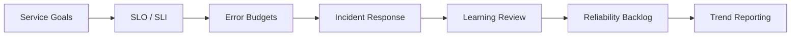

# Framework Overview

## What This Repository Does

This repository gives SRE teams a practical model for defining reliability objectives, governing error budgets, and improving incident response over time.
It provides a shared way to discuss service health, tradeoffs, and improvement priorities.
The framework is meant to make reliability decisions easier to compare and easier to explain.

## Operating Flow

## What It Covers

- SLO and SLI governance
- error budget policy
- availability modeling
- incident management
- reliability maturity
- MTTR reduction
- operational reporting

## Who Uses It

- SRE teams
- platform engineers
- service owners
- engineering leaders
- reliability governance stakeholders

## What Good Looks Like

- objectives are explicit
- budgets are visible and actionable
- incidents produce learning
- reliability trends are measured
- service ownership is clear
- post-incident actions are tracked to closure

## How To Read It

Start with the framework overview, then move into the SRE operating model and SLO/SLI governance.
That sequence keeps the focus on what should be protected before getting into how to measure it.

## Result

The framework helps teams make reliability work visible, measurable, and easier to improve over time.

## Practical Use

Use this framework when you need to explain how reliability decisions are made, measured, and improved across services.

## Outputs

- operating model
- scorecard
- review template
- incident template
- maturity model

## Reliability Layers

| Layer | Question | Artifact |
| --- | --- | --- |
| Targets | What are we trying to protect? | SLO/SLI template |
| Control | How do we manage tradeoffs? | Error budget governance |
| Response | What happens when service health fails? | Incident template |
| Improvement | What changes next? | Reliability review template |
| Measurement | How do we know it improved? | KPI dashboard |
